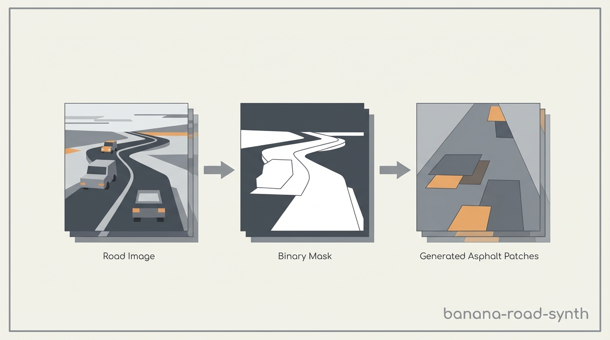
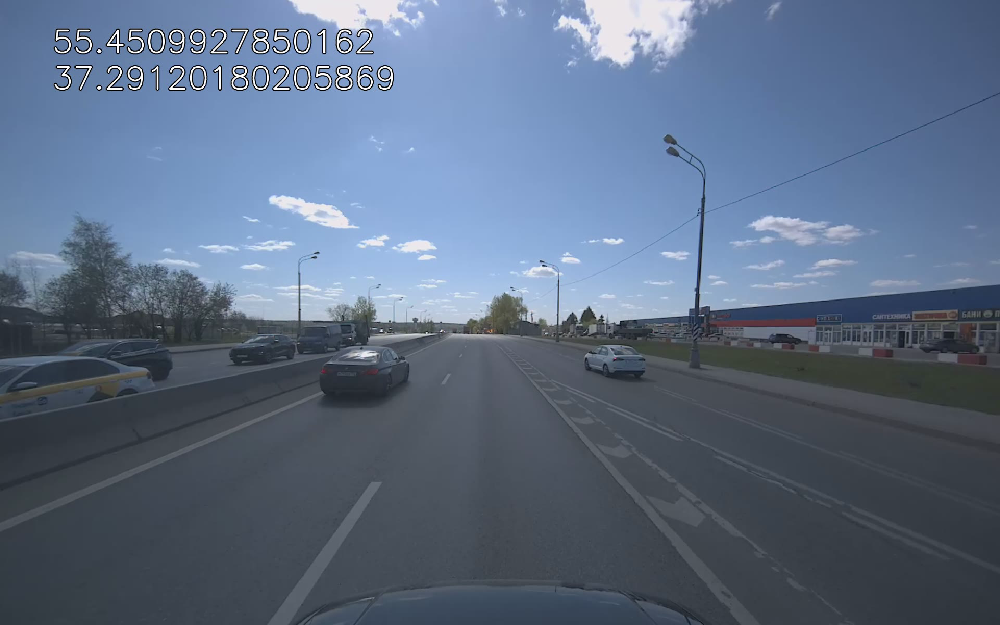
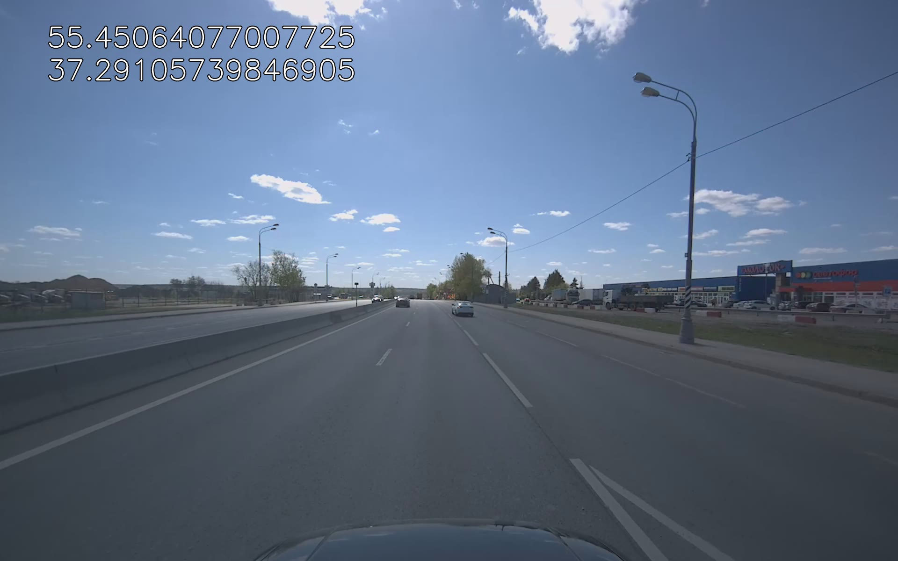
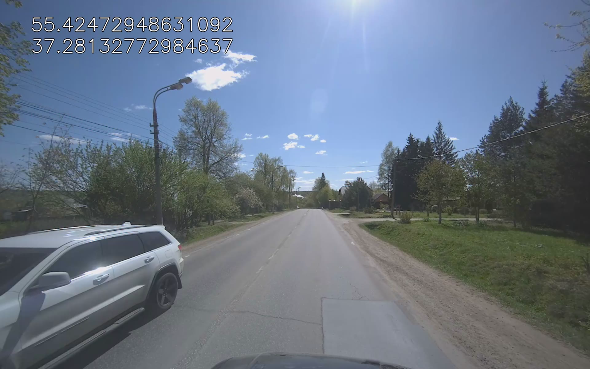
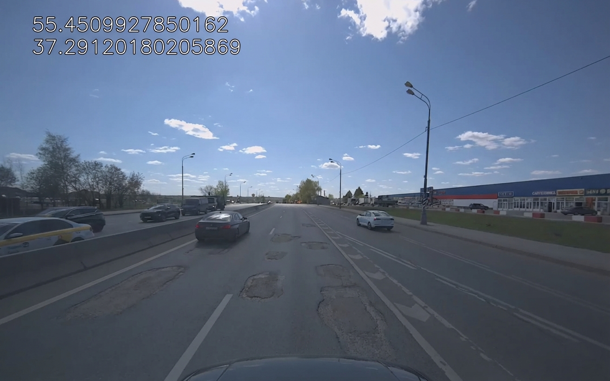
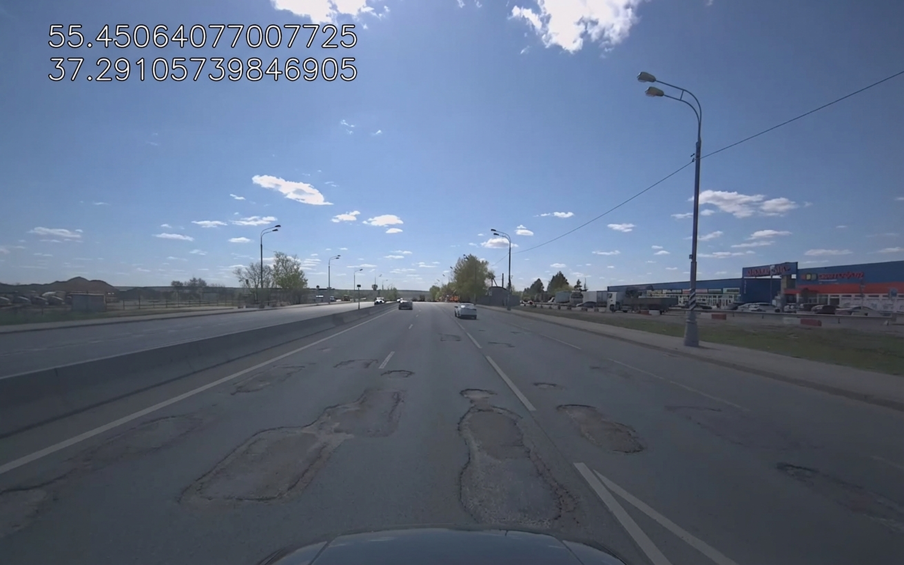
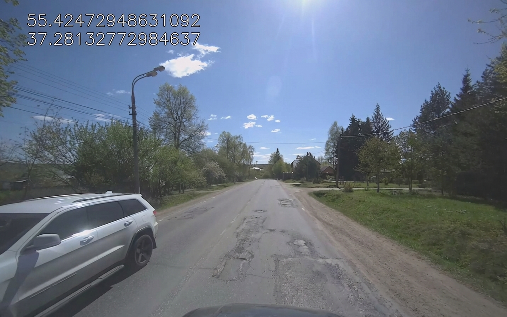

# Banana-road-synth



Minimal Python pipeline for generating synthetic road defects
(patches, potholes, lighting conditions) on top of real road images
using Gemini image models.

The goal is fast dataset expansion for computer vision experiments
when real labeled data is scarce or domain-specific.

---

## Examples
### Before




### After




---

## What this repository contains

A single script that processes a folder of road images and produces:

- synthetic asphalt repair patches using generated binary masks
- corresponding masks (usable as labels)
- visual overlays for sanity check
- optional lighting change (evening)

The pipeline is intentionally simple and explicit.

---

## What this is **not**

- Not a full dataset generation framework
- Not a training pipeline
- Not a replacement for real data
- Not a general-purpose segmentation solution

This is a **data generation utility**, nothing more.

---

## Requirements

- Python 3.9+
- Gemini API access

Install dependencies:

```bash
pip install -r requirements.txt
```

---

## Configuration

All configuration is located in `config.py`:

- `GEMINI_API_KEY` – your API key
- `MODEL` – Gemini image model name
- `INPUT_DIR` – absolute path to input images
- output directory names
- all prompts used by the pipeline

Only `INPUT_DIR` must be changed to run the script.

---

## Usage

```bash
python generate.py
```

The script will:

1. Scan `INPUT_DIR` recursively for images
2. Generate outputs for each image
3. Skip files that were already processed
4. Save results into output folders next to the script

---

## Output structure

```text
banana-road-synth/
├── generate.py
├── config.py
├── requirements.txt
├── out_masks/        # binary masks (labels)
├── out_patches/      # images with synthetic patches
├── out_overlay/      # visualization overlays
├── out_evening/      # lighting-modified images
└── out_semseg/       # experimental semantic segmentation
```

---

## Notes on semantic segmentation

Semantic segmentation included in this pipeline is **experimental**.

The model may:
- confuse curbs, barriers, and parapets
- hallucinate traffic signs
- misinterpret shadows

---

## License

MIT

---
